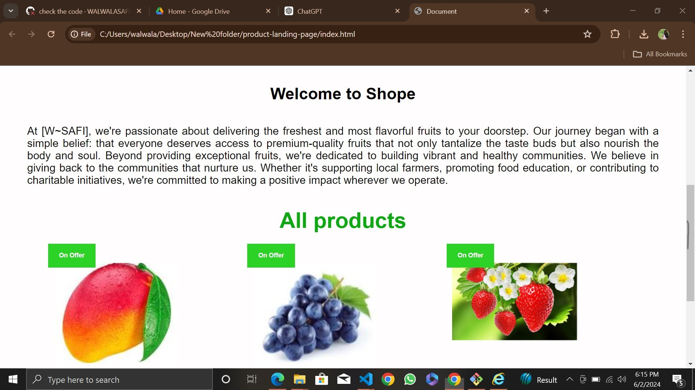

product_landing_page🚀
Project Description 📝
offering convenience, quality, and a wide selection of produce. Here's a description that captures its essence:

Convenience at Your Doorstep: With online fresh fruit shopping, the bounty of the orchard is just a click away. Say goodbye to long trips to the grocery store or local market. Now, you can browse through a diverse array of fresh fruits from the comfort of your home, office, or anywhere with an internet connection.Online fresh fruit shopping brings the farm-fresh goodness of nature directly to your fingertips,🥰

✅1:-- Convenience at Your Doorstep: With online fresh fruit shopping, the bounty of the orchard is just a click away. Say goodbye to long trips to the grocery store or local market. 

✅2:-- Quality Assurance: Trusted online platforms source their fruits directly from reputable growers and suppliers, ensuring top-notch quality and freshness. Each fruit is carefully inspected, handpicked at peak ripeness, and meticulously packed to preserve its flavor, texture, and nutritional value during transit.

✅3:-- Variety and Seasonality: Whether you crave the sweetness of summer berries, the tanginess of citrus fruits, or the crispness of fall apples, online fresh fruit stores offer a year-round assortment to suit every taste and craving. Plus, they often showcase specialty and exotic fruits that may be challenging to find locally, allowing you to explore new flavors and culinary adventures.

Demo 📸

Technologies Used 🛠️
🔹HTML
🔹CSS
🔹css grid

general requirement💻❗
Certainly! Here's a step-by-step guide to installing and setting up a technical documentation page project:

Prerequisites:

1️⃣creat a new repository in your github

2️⃣Create a New Project Directory:

Open your terminal or command prompt. Navigate to the directory where you want to create your project. Run the following command to create a new directory for your project: bash Copy code mkdir documentation-project

3️⃣open HTML in any program such you want ssuch us: vscode, terminal and cmd.

4️⃣creat a uniqe HTML file.

5️⃣give a style to project by creating style.css file. 

6️⃣ use (git add, git commint, git push) in the git bash to push it in Github.

7️⃣Make a string and uniqe project-Readme.md file.

Features ⭐
List the key features of your project. Highlight any unique or noteworthy functionalities.

Examples: feature1: font-family: Arial, Helvetica, sans-serif;

Author 🔵✅
Github: WALWALA SAFI (https://github.com/WALWALASAFI/product-landing-page.git)

Email: walwala safi (walwalasafi99@gmail.com)

Contributing 🤝
Thank you for considering contributing to [product-landing-page]! We welcome contributions from individuals like you who are passionate about improving our project. Below are some guidelines to help you get started. Code of Conduct:

1: Before contributing, please familiarize yourself with our Code of Conduct. We expect all contributors to adhere to these guidelines and maintain a respectful and inclusive environment for everyone.

How to Contribute:

There are several ways you can contribute to [Project Name], including:

Reporting Bugs Requesting Features Making Code Contributions via Pull Requests We appreciate contributions of all kinds, whether it's reporting a bug, suggesting a feature, or submitting code changes.